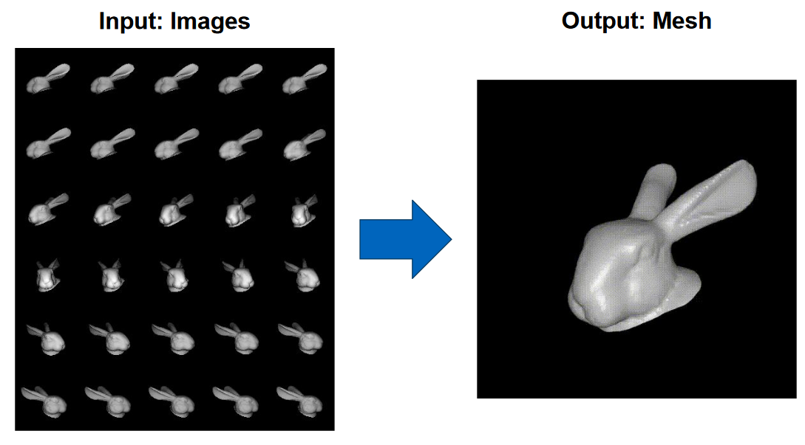
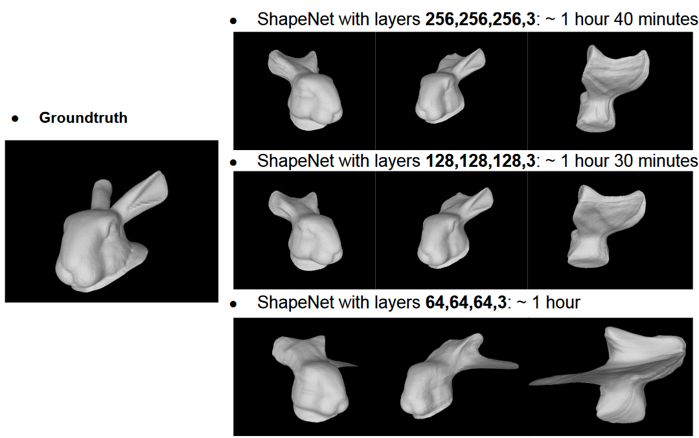

# 3D Object Shape Reconstruction
Computer vison-based 3D scene reconstruction based on "Diffeomorphic Neural Surface Parameterization for 3D and Reflectance Acquisition" by Cheng et al. ([Paper](https://dl.acm.org/doi/pdf/10.1145/3528233.3530741), [Code](https://github.com/za-cheng/DNS))

The approach makes use of an implicit neural velocity field to advect vertices of a unit sphere over multiple time steps into the shape of the reconstructed mesh.
This velocity field is trained by making use of differentiable rendering.

This is a resource constrained implementation to investigate the viability of separately modeling the background through use of a Neural Radiance Field.
The original implementation is constrained to images of objects with a black background, as well as requiring a corresponding object mask for each image.

We find that, while the current approach can be adapted to make use of only image data without the corresponding masks, adapting the method for an arbitrary background requires further research.

The final report may be found [here](reports/SRMCV_Final_Report.pdf).

### Instructions for running the code
1. Create and activate the environment provided using `conda create -f p3d3.yml; conda activate p3d3`
2. Create training and validation datasets with `python create_dataset.py`. If desired, the color of the cubes must be changed at this step.
3. Set up the config.yaml in the folder 'config' with the preferred hyper-parameters used for training and validation processes.
4. Add more '.yaml' files in the folder 'config' to run multiple training sessions 
 5. Run training with `python train.py`

Results are placed in the `out/` folder

The results may be viewed in a web browser at `http://localhost:6006/` by using `tensorboard --logdir=out`.

### Description of provided files for dataset creation
#### Camera settings
- cameras1.npz - Viewpoints from the front of the mesh
- cameras_behind.npz - Viewpoints from all sides of the mesh
- cameras_above.npz - Viewpoints from above the mesh
- cameras_below.npz - Viewpoints from below the mesh

#### Meshes 
- mesh.ply - mesh with bunny
- cubemesh.ply - mesh with both bunny and cubes for half-front rotation
- cubes.ply -  only cubes for half-front rotation  
- rotation_scene.ply - mesh with bunny and cubes for full rotation
- rotation_cubes.ply - mesh with cubes used when background is provided by our renderer when performing full rotation 
